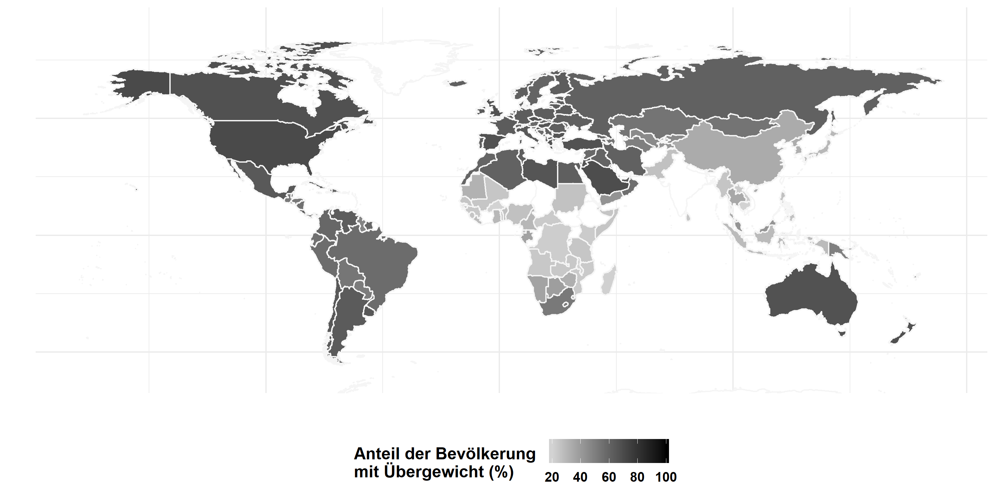

The textbook introduces the relevant theoretical and methodological principles of *effect evaluation* and illustrates them with selected examples. As the next illustration shows, the proportion of the population with overweight (and obesity) is high worldwide. For this reason, we examined the question of what extent food labeling measures can counteract this trend.

From:

Treischl, E. & Wolbring, T. (2020): Wirkungsevaluation. Grundlagen, Standards, Beispiele. Weinheim Basel: Beltz Juventa (Standards standardisierter und nichtstandardisierter Sozialforschung).
