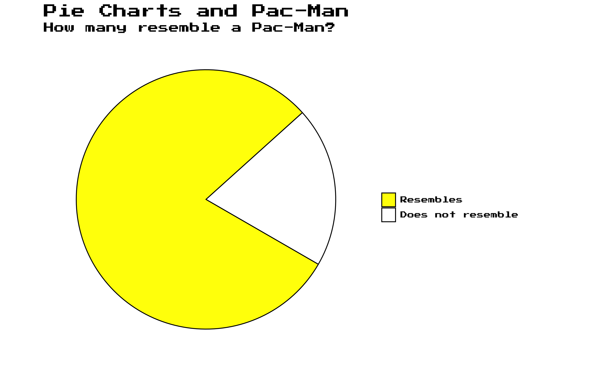

<link href="index_files/primer-tooltips/build.css" rel="stylesheet" />
<link href="index_files/klippy/css/klippy.min.css" rel="stylesheet" />

Pie charts are awful, and the Pie charts vs. Pacman underlines this point:

<figure>

<figcaption aria-hidden="true">Pie Chart</figcaption>
</figure>
