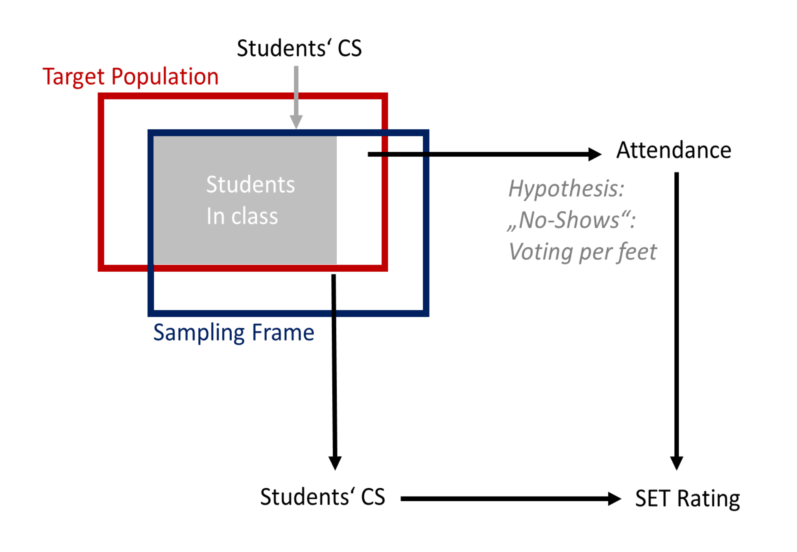

---

summary: "Student evaluation of teaching (SET) is an empirically well-established instrument for quality assurance in higher education. Most research shows that SET is a reliable and valid instrument to measure teaching quality from students' perception and in accordance with Seldins statement one may come to the conclusion, that: 'the opinions of those who eat the dinner should be considered if we want to know how it tastes' (Seldin 1993: 40). However, in many instances students can select courses they want to attend before the course starts, and even in mandatory courses students can often decide how regularly they attend. ..."

date: "2019-10-10"
title : "Selection Effects in Students’ Evaluation of Teaching"
subtitle: "Methodological Pitfalls for the Measurement of Teaching Quality (Inaugural dissertation)"
links:
- icon: link
  icon_pack: fas
  name: Link
  url: "../media/Diss_Treischl_Summary.pdf"
---

Student evaluation of teaching (SET) is an empirically well-established instrument for quality assurance in higher education. Most research shows that SET is a reliable and valid instrument to measure teaching quality from students' perception and in accordance with Seldins statement one may come to the conclusion, that: 'the opinions of those who eat the dinner should be considered if we want to know how it tastes' (Seldin 1993: 40). However, in many instances students can select courses they want to attend before the course starts, and even in mandatory courses students can often decide how regularly they attend. Fairness concern remain if those who eat the dinner can decide which cuisine they prefer before the dinner starts. And in terms of attendance, one may argue that SET results will be distorted if those who did not like the dinner decided to go home before they were asked about their opinion. Against this background this dissertation asks about the consequences of students’ course selection and attendance for SET and provides four research papers about students’ selection effects.

Cite this book:

Treischl, E. (2019): Selection Effects in Students’ Evaluation of Teaching. Methodological Pitfalls for the Measurement of Teaching Quality. Mannheim: University of Mannheim (Inaugural dissertation).
