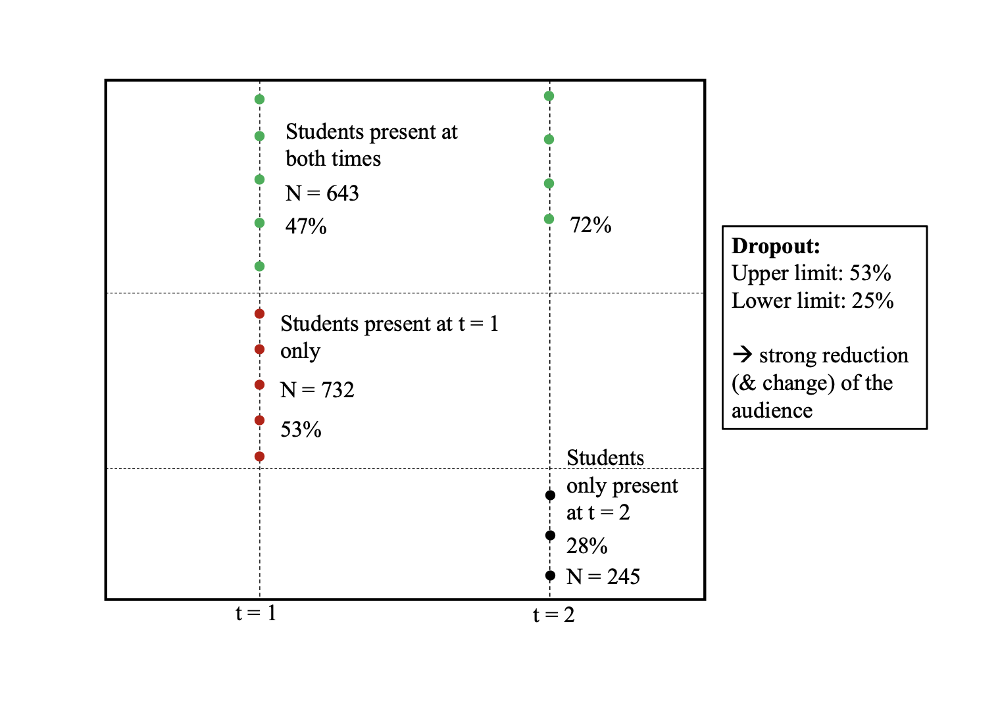

Systematic sampling error due to self-selection is a common topic in methodological research and a key challenge for every empirical study. Since selection bias is often not sufficiently considered as a potential flaw in research on and evaluations in higher education, the aim of this paper is to raise awareness for the topic using the case of students’ evaluations of teaching (SET). First, we describe students’ selection decisions at different points of their studies and elaborate potential biases which they might cause for SET. Then we empirically illustrate the problem and report findings from a design with two measurement points in time showing that approximately one third of the students do not attend class at the second time of measurement, when the regular SET takes place. 

Furthermore, the results indicate that the probability of absenteeism is influenced by course quality, students’ motivation, course topic, climate among course participants, course- and workload, and timing of the course. Although data are missing not at random, average ratings do not strongly change after adjusting for selection bias. However, we find substantial changes in rankings based on SET. We conclude from this that, at least as regards selection bias, SET are a reliable instrument to assess quality of teaching at the individual level but are not suited for the comparison of courses.

Cite this article

Wolbring, T. & Treischl, E. (2016): Selection Bias in Students’ Evaluation of Teaching. Res High Educ 57, 51–71. https://doi.org/10.1007/s11162-015-9378-7